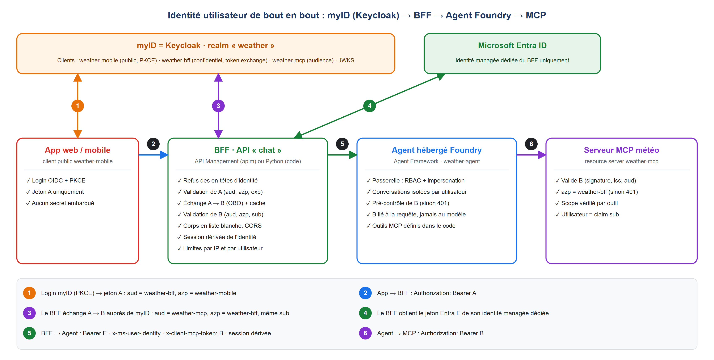

# POC : identité utilisateur de bout en bout (Keycloak / myID → APIM → Agent hébergé Foundry → MCP)

Ce POC montre comment propager l'identité d'un utilisateur authentifié par un **IdP externe OAuth 2 / OIDC**, ici un Keycloak qui joue le rôle de **myID**, jusqu'à un **serveur MCP**. Le chemin passe par un **agent hébergé Microsoft Foundry**, sans Entra ID pour les utilisateurs finaux.

Le **BFF est Azure API Management** : il n'y a aucun code applicatif. Des policies APIM valident le jeton de l'application, obtiennent le jeton destiné au MCP par **échange de jeton On-Behalf-Of (RFC 8693)** et délèguent l'identité de l'utilisateur à Foundry. L'application ne détient jamais de jeton pour le MCP.

Cas d'usage : un chat qui donne la météo d'une ville. Les outils MCP connaissent l'utilisateur (`whoami`, favoris par utilisateur).

> 📚 **Documentation détaillée** dans le répertoire [docs/](docs/) :
> - [Architecture et flux d'authentification](docs/ARCHITECTURE.md) : schéma de flux, diagramme de séquence, jetons, contrôles de sécurité ;
> - [Configuration Keycloak (myID)](docs/KEYCLOAK.md) ;
> - [Principes d'authentification (Word)](docs/Authentification-principes.docx).

## Architecture



Détail des flux, des jetons et des contrôles : [docs/ARCHITECTURE.md](docs/ARCHITECTURE.md).

| Problème | Solution |
|---|---|
| `"tools": Not allowed when agent is specified` | Les outils sont définis **dans le code de l'agent hébergé**. APIM reconstruit le corps de la requête : seuls `input` et `previous_response_id` passent (la session de l'agent est imposée par la passerelle). |
| Foundry n'accepte que des jetons Entra | APIM appelle Foundry avec une **identité managée dédiée** (`id-apim-chat`) et délègue l'identité de l'utilisateur via `x-ms-user-identity` (rôle custom `UserIdentityImpersonation`). |
| Le conteneur ne reçoit pas `Authorization` | Le jeton MCP passe dans l'en-tête **`x-client-mcp-token`**. Les en-têtes `x-client-*` sont les seuls en-têtes personnalisés que la passerelle Foundry transmet. |
| Pas de jeton MCP sur le terminal | **OBO** : seul APIM (client confidentiel `weather-bff`) peut obtenir B, et le MCP n'accepte que `azp=weather-bff`. |
| Usurpation d'identité par le client | Un client qui envoie `x-ms-user-identity`, `x-client-*` ou `x-agent-*` est **rejeté** (400). |
| Concurrence entre utilisateurs | Le jeton est lié au contexte de la requête (`ContextVar`). Le `header_provider` reconnecte la session MCP quand l'identité change. |

### Policies APIM ([platform/apim](platform/apim))

| Fichier | Rôle |
|---|---|
| `api-chat.xml` | Toutes les opérations : CORS (origine de l'app web uniquement), limite par IP, refus des en-têtes d'identité, validation de A, limite par utilisateur |
| `fragments/reject-sensitive-headers.xml` | 400 si le client envoie un en-tête d'identité |
| `fragments/validate-app-token.xml` | Valide A (JWKS du realm, `iss`, `aud = weather-bff`, `azp = weather-mobile`, `exp`) et calcule l'identité déléguée |
| `fragments/obo-exchange.xml` | Échange A → B avec le secret de `weather-bff` (named value Key Vault), mise en cache par hash de A, validation de B (`aud`, `azp`, même `sub`, `weather:read`), erreurs génériques |
| `fragments/foundry-delegation.xml` | Jeton Entra via l'identité dédiée, `x-ms-user-identity`, `x-client-mcp-token` |
| `op-responses.xml` | `POST /chat/responses` : corps en liste blanche (`input` ≤ 4000 caractères, `previous_response_id`), **session de l'agent imposée par la passerelle** (dérivée de l'identité ; tout `agent_session_id` envoyé par le client est rejeté), réécriture vers l'endpoint Responses de l'agent |
| `op-me.xml` | `GET /chat/me` : identité validée par la passerelle (claims uniquement, jamais de jeton) |

Journalisation : Application Insights **sans en-têtes ni corps** (aucun jeton dans les journaux).

> **Constat du test de sécurité** : Foundry isole les *conversations* entre utilisateurs délégués (`previous_response_id` d'un autre utilisateur → 404), mais **pas les sessions** (bac à sable du conteneur). C'est pourquoi la passerelle choisit elle-même la session de l'agent.

## Arborescence

```
weather-agent/                    projet azd : projet Foundry + modèle + agent hébergé
  azure.yaml
  infra/                          Bicep Foundry (issu de `azd ai agent init --infra`, resource group existant supporté)
  src/weather-agent/main.py       agent Agent Framework (middleware + MCP header_provider)
platform/
  infra/main.bicep                ACR, Container Apps (Keycloak, MCP, web), PostgreSQL, Key Vault, App Insights, APIM, identités, rôles Foundry
  infra/apim-config.bicep         configuration APIM : named values, fragments, API « chat », diagnostics
  apim/                           policies APIM (le BFF)
  keycloak/                       image Keycloak, realm-config.json (source de vérité), configure_realm.py
  src/mcp-weather/server.py       serveur MCP météo (Open-Meteo), validation JWT
  src/web/                        client web statique (nginx, oidc-client-ts, config et CSP injectées au démarrage)
  .env.example                    paramètres de déploiement → copier en platform/.env
tools/e2e_test.py                 test de bout en bout et de sécurité (lancé par deploy.ps1)
tools/fake_idp.py                 faux émetteur OIDC (avec token exchange) pour les tests locaux
docs/ARCHITECTURE.md              architecture et flux d'authentification (avec diagrammes)
docs/KEYCLOAK.md                  configuration Keycloak / transposition au vrai myID
docs/Authentification-principes.docx, docs/diagrams/   principes d'authentification et diagrammes
deploy.ps1 / teardown.ps1         déploiement / suppression d'un environnement (un resource group)
```

## Déployer

Le déploiement se fait **entièrement dans Azure** : les images sont construites à distance (ACR Tasks), **Docker n'est pas nécessaire**. Côté poste, il suffit des outils ci-dessous et d'un environnement Python minimal (un seul paquet).

> ℹ️ Les commandes de la section [Tester localement](#tester-localement-sans-conteneur-ni-keycloak) (serveur MCP, agent, faux IdP) ne sont **pas** nécessaires pour déployer.

### 1. Prérequis

| Outil | Version | Pourquoi |
|---|---|---|
| **PowerShell** | **7.x** (`pwsh`) | `deploy.ps1` et `teardown.ps1`. Windows PowerShell 5.1 n'est **pas** supporté |
| **Azure CLI** (`az`) | 2.60+ (avec Bicep : `az bicep install`) | Déploiement Bicep, Key Vault, ACR Tasks |
| **Azure Developer CLI** (`azd`) | 1.27.1+ | Projet Foundry, modèle et agent hébergé |
| Extensions azd | `azure.ai.agents`, `azure.ai.projects`, `microsoft.foundry` | Hosted agents Foundry |
| **Python** | 3.11+ | Configuration du realm Keycloak et test de bout en bout (paquet `httpx`) |
| **Git** | — | Cloner le dépôt |

**Droits Azure** : rôle **Owner** (ou *Contributor* + *User Access Administrator*) sur la souscription ou sur le resource group cible. Le déploiement crée un rôle personnalisé et des role assignments.

**Région** : une région qui propose à la fois les **hosted agents Foundry**, le modèle `gpt-5.4-mini` (GlobalStandard) et **API Management v2**. Le POC est validé en **France Central**.

### 2. Préparer le poste (une seule fois)

```powershell
# Extensions azd
azd extension install azure.ai.agents
azd extension install azure.ai.projects
azd extension install microsoft.foundry

# Connexion : même compte et même tenant pour az et azd
az login --tenant <tenant-id>
az account set --subscription <subscription-id>
azd auth login --tenant-id <tenant-id>

# Environnement Python minimal, à la racine du dépôt
# (deploy.ps1 utilise .venv-dev s'il existe, sinon le `python` du PATH)
python -m venv .venv-dev
.\.venv-dev\Scripts\python -m pip install --upgrade pip httpx
```

### 3. Configurer

```powershell
Copy-Item platform\.env.example platform\.env
```

Dans `platform/.env`, renseignez le nom de l'environnement (`AZD_ENVIRONMENT`), la région (`AZURE_LOCATION`) et le resource group (`AZURE_RESOURCE_GROUP`). Ce fichier ne contient **aucun secret** : ils sont générés par le script et stockés uniquement dans le Key Vault.
- **Resource group existant** : il est réutilisé tel quel, avec sa région. **Ses tags ne sont jamais modifiés** : [weather-agent/infra/main.bicep](weather-agent/infra/main.bicep) ne crée le groupe que s'il n'existe pas, et `deploy.ps1` vérifie les tags après chaque étape.
- Sinon, le resource group est créé.

### 4. Déployer

```powershell
pwsh ./deploy.ps1
```

Durée : environ **30 à 45 minutes** pour un premier déploiement (API Management et PostgreSQL sont les plus longs). Le script enchaîne :
1. création de l'environnement azd ;
2. `azd provision` (projet Foundry et modèle) ;
3. registre, environnement Container Apps, Key Vault, identités, App Insights et service API Management ;
4. génération des secrets dans le Key Vault et build distant des images ;
5. PostgreSQL, Keycloak, MCP et application web ;
6. configuration du realm Keycloak, puis de l'API « chat » d'APIM (les policies ont besoin du realm) ;
7. `azd deploy` de l'agent ;
8. test de bout en bout et de sécurité (usurpation d'en-têtes, jeton falsifié, corps en liste blanche, accès croisé entre utilisateurs, CORS, limitation de débit).

### 5. Utiliser

Ouvrez l'URL de l'application web affichée à la fin du script. Connectez-vous avec `alice` (premium) ou `bob` (basic) et posez une question : « Quel temps fait-il à Lyon ? », « Qui suis-je pour le serveur MCP ? ».

Les mots de passe sont dans le Key Vault :

```powershell
az keyvault secret show --vault-name <key-vault> --name alice-password --query value -o tsv
```

### Mettre à jour, dépanner

- Le script est **idempotent** : relancez-le pour appliquer une modification. Il réutilise les secrets du Key Vault.
  - `-SkipImages -SkipTests` : mise à jour de configuration seule.
  - `-SkipImages` : reprise après une erreur, quand les images sont déjà construites.
- Erreur `TokenCreatedWithOutdatedPolicies` ou `InteractionRequired` : reconnectez-vous (`az logout`, `az login --tenant <tenant-id>`, puis `azd auth login --tenant-id <tenant-id>`) et relancez le script.
- Sauvegardes produites dans `backups/<environnement>/` (aucun secret, dossier ignoré par git) :
  - `deployment.json` : URLs, noms des ressources, images ;
  - `realm-export-*.json` : export du realm, secrets masqués par Keycloak.

## Supprimer un environnement

```powershell
./teardown.ps1 -Environment agentmcp-kc -WhatIf    # aperçu
./teardown.ps1 -Environment agentmcp-kc            # export du realm et des secrets (hors dépôt), puis suppression
```

Si le resource group existait avant le déploiement, `teardown.ps1` supprime les ressources mais **conserve le groupe et ses tags**. Sinon, il supprime le resource group.

## Tester localement (sans conteneur ni Keycloak)

> **Optionnel**, pour développer ou déboguer l'agent et le serveur MCP sur votre poste. Ce n'est **pas** nécessaire pour déployer.

```powershell
python -m venv .venv-dev; .\.venv-dev\Scripts\pip install -r platform\src\mcp-weather\requirements.txt starlette
.\.venv-dev\Scripts\python tools\fake_idp.py                                    # http://localhost:9000/ (mint + token exchange)
$env:OIDC_ISSUER='http://localhost:9000/'; $env:OIDC_JWKS_URI='http://localhost:9000/.well-known/jwks.json'
$env:MCP_AUDIENCE='weather-mcp'; $env:MCP_ALLOWED_AZP='weather-bff'
.\.venv-dev\Scripts\python platform\src\mcp-weather\server.py                   # http://localhost:8000/mcp
# Agent (dans weather-agent/src/weather-agent, .env renseigné avec MCP_SERVER_URL=http://127.0.0.1:8000/mcp)
.\.venv\Scripts\python main.py                                                   # http://localhost:8088
$tok = Invoke-RestMethod "http://127.0.0.1:9000/mint?aud=weather-mcp&azp=weather-bff&sub=alice"
Invoke-RestMethod http://127.0.0.1:8088/responses -Method Post -ContentType 'application/json' `
  -Headers @{ 'x-client-mcp-token' = $tok } -Body '{"input":"Quel temps fait-il a Lyon ?"}'
```

Dans VS Code, **F5** lance l'agent local avec le débogueur et ouvre l'Agent Inspector de Foundry Toolkit. Il faut fournir l'en-tête `x-client-mcp-token`, sinon l'agent répond 401.

Les policies APIM ne s'exécutent pas localement : elles sont validées par le test de bout en bout ([tools/e2e_test.py](tools/e2e_test.py)) lancé à chaque déploiement.

## Sécurité : ce qui reste à faire pour la production

- Keycloak en haute disponibilité (AKS + Keycloak Operator), PostgreSQL en haute disponibilité et en accès privé, custom domain, WAF, console d'administration non exposée.
- Authentifier `weather-bff` (utilisé par APIM) par `private_key_jwt` ou mTLS plutôt que par un secret.
- Front Door + WAF devant APIM, puis APIM et backends en réseau privé.
- Placer aussi le serveur MCP derrière APIM (`validate-jwt`, rate limiting), ou le rendre privé.
- Persister l'état du MCP (favoris) dans un vrai stockage, partitionné par `sub`.
- Mettre en place des alertes sur les échecs de validation et d'échange de jetons (App Insights d'APIM, logs MCP et Keycloak).
