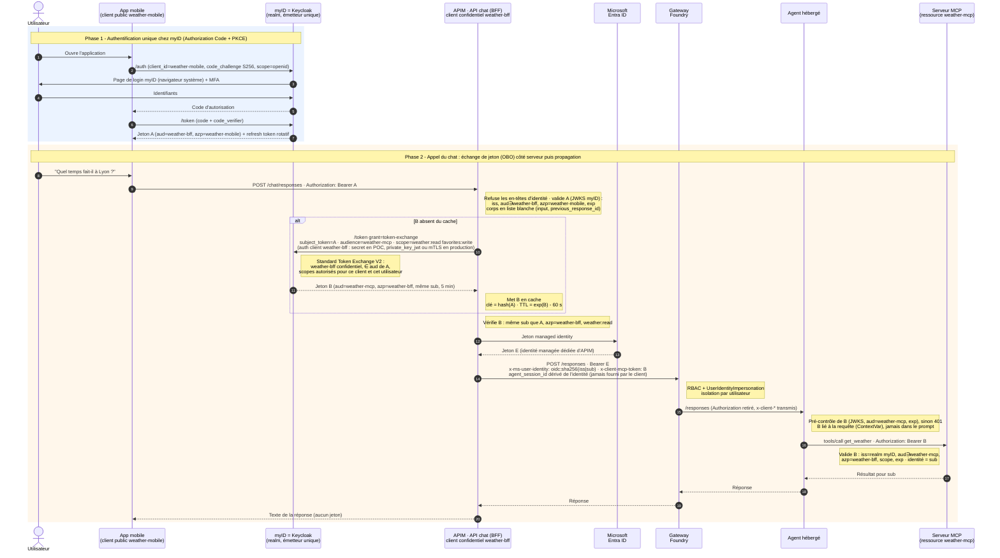

# Architecture et flux d'authentification

Cette page explique comment l'identité d'un utilisateur authentifié par **myID (Keycloak)** est propagée jusqu'au **serveur MCP**, en passant par **Azure API Management** (le BFF) et un **agent hébergé Microsoft Foundry**. Elle décrit aussi comment les jetons sont protégés à chaque étape.

Le BFF existe en **deux implémentations interchangeables** (`BFF_MODE`) : des policies **API Management** (mode `apim`, décrit ci-dessous) ou un **service Python** (mode `code`). Elles respectent le même contrat et passent les mêmes tests : voir [§ 8](#8-deux-implémentations-du-bff-bff_mode).

> Version détaillée (principes, menaces, limites) : [Authentification-principes.docx](Authentification-principes.docx). Configuration de l'IdP : [KEYCLOAK.md](KEYCLOAK.md).

## 1. Le problème à résoudre

- Les utilisateurs sont dans un **IdP externe** (myID, un Keycloak), pas dans Entra ID.
- **Foundry n'accepte que des jetons Entra ID**, et son mode « OAuth identity passthrough » exige des utilisateurs Entra du même tenant.
- Les outils d'un agent référencé **ne peuvent pas être redéfinis dans la requête** (`tools: Not allowed when agent is specified`).
- Pourtant, le serveur MCP doit savoir **quel utilisateur** l'appelle, et pouvoir le **vérifier**.

## 2. Les composants

| Composant | Rôle | Identité portée |
|---|---|---|
| **Application web / mobile** (`ca-web`) | Authentifie l'utilisateur (OIDC Authorization Code + PKCE) et appelle le BFF | Client **public** `weather-mobile`, aucun secret |
| **myID (Keycloak)**, realm `weather` | Émet les jetons, réalise l'échange de jeton (RFC 8693), publie ses clés (JWKS) | Émetteur unique (`iss`) |
| **Azure API Management**, API `chat` | **Le BFF**, sans code applicatif (policies) : valide le jeton, l'échange, délègue l'identité à Foundry | Client **confidentiel** `weather-bff` + identité managée **dédiée** `id-apim-chat` |
| **Microsoft Entra ID** | Émet le jeton de service d'APIM pour Foundry | — |
| **Passerelle Foundry** | Vérifie les droits d'APIM, isole les conversations par utilisateur, filtre les en-têtes | — |
| **Agent hébergé** (`weather-agent`) | Agent Framework : utilise le jeton de l'utilisateur pour appeler le serveur MCP | Identité d'agent (appels au modèle) |
| **Serveur MCP** (`ca-mcp-weather`) | Outils météo et favoris, identifie l'utilisateur à partir du jeton | Resource server `weather-mcp` |

## 3. Schéma de flux


1. **Authentification** : l'utilisateur se connecte à myID (Authorization Code + PKCE, navigateur système). L'application reçoit le **jeton A** (`aud = weather-bff`, `azp = weather-mobile`) et un refresh token rotatif. Elle n'obtient **jamais** de jeton pour le serveur MCP.
2. L'application appelle APIM (`POST /chat/responses`) avec A.
3. **Échange de jeton (On-Behalf-Of)** : APIM présente A à myID avec les identifiants du client confidentiel `weather-bff` et demande `audience = weather-mcp`. myID renvoie le **jeton B** : même utilisateur (`sub`), `azp = weather-bff`, uniquement les scopes auxquels l'utilisateur a droit. APIM met B en cache jusqu'à son expiration.
4. APIM obtient auprès d'Entra ID le **jeton E** de son identité managée dédiée : il représente APIM, pas l'utilisateur.
5. APIM appelle l'agent avec :
   - E ;
   - l'**identité déléguée** `x-ms-user-identity = oidc:sha256(iss|sub)` ;
   - le jeton B dans `x-client-mcp-token` ;
   - une **session d'agent dérivée de l'identité**.
6. La passerelle Foundry valide E et le droit d'impersonation, isole la conversation par utilisateur, **retire** `Authorization` et relaie les en-têtes `x-client-*` au conteneur.
7. L'agent pré-contrôle B, puis le présente au serveur MCP. Celui-ci le valide (`aud`, `azp = weather-bff`, scope) et identifie l'utilisateur par `sub`.

Les flèches en pointillés vers myID représentent la récupération des **clés publiques (JWKS)**, mises en cache, qui permettent à chaque composant de vérifier les signatures lui-même.

## 4. Diagramme de séquence


<details>
<summary>Version Mermaid (rendue par GitHub)</summary>



Source : [diagrams/sequence.mmd](diagrams/sequence.mmd). L'image ci-dessus est générée avec `mmdc -i sequence.mmd -o sequence-authentification.png -c mermaid-config.json`.

</details>

**Phase 1 · Authentification.** L'application génère un secret éphémère (`code_verifier`) dont elle n'envoie que l'empreinte (PKCE). Seul le détenteur du secret peut ensuite échanger le code contre des jetons. Aucun secret n'est embarqué dans l'application, et la saisie des identifiants (et du MFA) se fait chez myID.

**Phase 2 · Appel du chat.** APIM refuse les en-têtes d'identité fournis par le client, valide A, filtre le corps de la requête et échange A contre B (sauf si B est en cache). Il vérifie B, obtient E, puis appelle l'agent. L'agent attache B aux seuls appels MCP de **cette** requête. Le serveur MCP répond pour l'utilisateur identifié par `sub`. Aucun jeton n'est renvoyé à l'application.

## 5. Les jetons

| Jeton | Émetteur | Audience (`aud`) | Émis à (`azp`) | Circule | Durée | Validé par |
|---|---|---|---|---|---|---|
| **A** – utilisateur | myID | `weather-bff` | `weather-mobile` | App → APIM | 5 min | APIM |
| **B** – utilisateur (OBO) | myID (échange) | `weather-mcp` | `weather-bff` | APIM → Foundry → agent → MCP | 5 min | APIM, agent, MCP |
| **E** – service | Entra ID | Foundry | APIM (identité dédiée) | APIM → Foundry | géré par Azure | Passerelle Foundry |
| Refresh token | myID | — | `weather-mobile` | reste sur l'app | rotatif | myID |

**Un jeton, une audience** : A n'est jamais transmis au serveur MCP (qui le refuse), il est **échangé**. Si un jeton fuit, il ne peut pas être rejoué contre une autre API.

## 6. À quoi sert l'échange de jeton (OBO)

Sans échange, il faudrait soit transmettre le jeton de l'application au serveur MCP (*token passthrough*, interdit par la spécification MCP), soit que l'application obtienne elle-même un jeton pour le serveur MCP. L'échange côté serveur apporte trois garanties :

1. Le jeton destiné au MCP **n'existe jamais sur le terminal** : un téléphone volé ou une application compromise ne peut pas appeler le serveur MCP.
2. **Seul APIM peut l'obtenir** : l'échange exige le secret du client confidentiel `weather-bff`, stocké dans Key Vault. Un client public reçoit une erreur.
3. Le serveur MCP **exige `azp = weather-bff`** : tout jeton obtenu par un autre chemin est rejeté.

Règles du *Standard Token Exchange* de Keycloak (≥ 26.2) utilisées ici :

- le client demandeur doit être **confidentiel** et figurer dans l'`aud` du jeton présenté (mapper Audience `weather-bff` sur `weather-mobile`) ;
- l'`audience` demandée doit être un client du même realm (`weather-mcp`) ;
- les scopes de B viennent des **client scopes optionnels** de `weather-bff`, et `favorites:write` n'est accordé qu'au rôle `weather-premium` ;
- révoquer A ne révoque pas B, d'où la durée de vie courte de B.

## 7. Contrôles à chaque étape

### Le BFF (API Management ou service Python)

Implémentation : policies dans [platform/apim](../platform/apim) (mode `apim`) ou service Python dans [platform/src/bff](../platform/src/bff) (mode `code`), voir [§ 8](#8-deux-implémentations-du-bff-bff_mode). Chaque étape échoue **de façon fermée** : une erreur arrête la requête avant l'appel à l'agent.

| Étape | Contrôle | Échec |
|---|---|---|
| CORS | Seule l'origine de l'application web est autorisée | refus navigateur |
| Limite par IP | 120 requêtes / minute avant authentification | 429 |
| En-têtes d'identité | `x-ms-user-identity`, `x-client-*`, `x-agent-*` envoyés par le client sont **rejetés** | 400 |
| Jeton A (`validate-jwt`) | Signature (JWKS), `iss`, `aud = weather-bff`, `azp = weather-mobile`, expiration | 401 |
| Limite par utilisateur | 30 requêtes / minute par `sub` | 429 |
| Corps en liste blanche | Seuls `input` (1 à 4000 caractères) et `previous_response_id` sont acceptés ; le corps est **reconstruit** (pas de `tools`, `instructions`, `model`, `agent_session_id`) | 400 |
| Échange OBO | A → B avec le secret de `weather-bff` (named value Key Vault), mise en cache par empreinte de A | 502 générique |
| Jeton B | Signature, `aud = weather-mcp`, `azp = weather-bff`, même `sub` que A, scope `weather:read` | 502 / 403 |
| Délégation | Jeton Entra de l'identité **dédiée**, identité déléguée, `x-client-mcp-token`, session dérivée de l'identité | — |

Journalisation : Application Insights reçoit métriques et erreurs **sans en-têtes ni corps**. Aucun jeton ne peut s'y retrouver.

### Agent hébergé

- Le jeton B est lu dans `x-client-mcp-token`, **pré-contrôlé** (signature, `aud`, expiration) et conservé dans une `ContextVar` limitée à la requête. Sans jeton valide, l'agent répond **401 avant tout appel au modèle**.
- B n'apparaît **jamais** dans le prompt, l'historique, les arguments des outils, les journaux ou `$HOME` : une injection de prompt ne peut pas l'exfiltrer.
- Le client MCP ajoute `Authorization: Bearer B` à chaque appel. Si l'identité change entre deux requêtes, la connexion MCP est reconstruite.

### Serveur MCP

- Valide B lui-même : signature, `iss`, `aud = weather-mcp`, `azp ∈ MCP_ALLOWED_AZP` (`weather-bff`), expiration.
- L'utilisateur est **toujours** déterminé par le claim `sub`, jamais par un argument que le modèle pourrait remplir.
- Les scopes sont vérifiés **outil par outil** (`weather:read`, `favorites:write`).

## 8. Deux implémentations du BFF (`BFF_MODE`)

Le BFF est choisi dans `platform/.env` : `BFF_MODE="apim"` (défaut) ou `BFF_MODE="code"`. Les deux exposent **le même contrat** (`POST /chat/responses`, `GET /chat/me`, mêmes codes d'erreur), appliquent **les mêmes contrôles dans le même ordre**, et [tools/e2e_test.py](../tools/e2e_test.py) les valide tous les deux. L'application web, Keycloak, l'agent et le serveur MCP sont identiques.

### Correspondance policy APIM ↔ code Python

| Étape | API Management ([platform/apim](../platform/apim)) | Python ([platform/src/bff](../platform/src/bff)) |
|---|---|---|
| CORS | `<cors>` dans [api-chat.xml](../platform/apim/api-chat.xml) | `CORSMiddleware` dans [app.py](../platform/src/bff/app.py) |
| Limites par IP et par utilisateur | `rate-limit-by-key` dans [api-chat.xml](../platform/apim/api-chat.xml) | `SlidingWindowLimiter` ([security.py](../platform/src/bff/security.py)), appelé par `authenticated_user` ([app.py](../platform/src/bff/app.py)) |
| Refus des en-têtes d'identité | [reject-sensitive-headers.xml](../platform/apim/fragments/reject-sensitive-headers.xml) | `has_forbidden_header` ([security.py](../platform/src/bff/security.py)) |
| Validation de A | `validate-jwt` dans [validate-app-token.xml](../platform/apim/fragments/validate-app-token.xml) | `validate_app_token` ([tokens.py](../platform/src/bff/tokens.py)) |
| Identité déléguée | variable `delegatedIdentity` ([validate-app-token.xml](../platform/apim/fragments/validate-app-token.xml)) | `delegated_identity` ([tokens.py](../platform/src/bff/tokens.py)) |
| Corps en liste blanche | [op-responses.xml](../platform/apim/op-responses.xml) | `parse_chat_body` ([app.py](../platform/src/bff/app.py)) |
| **Échange OBO + cache** | `send-request`, `cache-lookup-value` / `cache-store-value` ([obo-exchange.xml](../platform/apim/fragments/obo-exchange.xml)) | **`OboExchanger.exchange`** ([tokens.py](../platform/src/bff/tokens.py)) |
| Validation de B | `validate-jwt token-value` + contrôle `sub` / scope ([obo-exchange.xml](../platform/apim/fragments/obo-exchange.xml)) | `validate_mcp_token` ([tokens.py](../platform/src/bff/tokens.py)) |
| Jeton Entra + délégation | [foundry-delegation.xml](../platform/apim/fragments/foundry-delegation.xml) | `FoundryAgentClient.respond` ([foundry.py](../platform/src/bff/foundry.py)) |
| Session dérivée de l'identité | [op-responses.xml](../platform/apim/op-responses.xml) | `session_for` ([foundry.py](../platform/src/bff/foundry.py)) |
| Appel de l'agent | `rewrite-uri` + `forward-request` | `POST {agent}/responses?api-version=v1` ([foundry.py](../platform/src/bff/foundry.py)), réponse relayée telle quelle |

### L'échange de jeton en Python

C'est une simple requête HTTP vers le token endpoint de myID ([tokens.py](../platform/src/bff/tokens.py)) :

```python
resp = await http.post(token_endpoint, data={
    "grant_type": "urn:ietf:params:oauth:grant-type:token-exchange",   # RFC 8693
    "subject_token": token_a,                                          # jeton de l'application
    "subject_token_type": "urn:ietf:params:oauth:token-type:access_token",
    "requested_token_type": "urn:ietf:params:oauth:token-type:access_token",
    "audience": "weather-mcp",                                         # ressource visée
    "scope": "weather:read favorites:write",                           # accordés selon les rôles
    "client_id": "weather-bff",                                        # client confidentiel
    "client_secret": secret,                                           # lu dans Key Vault
})
token_b = resp.json()["access_token"]   # aud=weather-mcp, azp=weather-bff, même sub
```

Le BFF met ensuite B en cache (clé : empreinte SHA-256 de A, jusqu'à 60 s avant son expiration), puis **revalide B à chaque requête** : signature, `aud`, `azp = weather-bff`, même `sub` que A, scope `weather:read`.

### Différences entre les deux modes

| | `apim` | `code` |
|---|---|---|
| Code applicatif | aucun (policies XML) | ~400 lignes Python lisibles |
| Identité appelant Foundry | `id-apim-chat` (dédiée) | `id-bff` (dédiée) |
| Limitation de débit | approximative (compteurs APIM v2 asynchrones) | exacte (un seul réplica ; Redis pour passer à l'échelle) |
| Tests | bout en bout uniquement | [tests locaux sans Azure](../tools/test_bff_local.py) + bout en bout |
| Déploiement | plus long et plus coûteux (service API Management) | plus rapide et moins coûteux (une Container App) |
| Extensions possibles | gouvernance, quotas, AI Gateway, catalogue d'API | logique métier, DPoP, tests unitaires |

**Un environnement = un mode** : `deploy.ps1` refuse de changer le mode d'un environnement existant. Sinon, l'identité de l'ancien mode conserverait son droit d'impersonation. Utilisez un autre environnement azd / resource group, ou supprimez d'abord l'environnement avec `teardown.ps1`.

## 9. Identité déléguée et sessions Foundry

- `x-ms-user-identity = oidc:` + SHA-256(`iss` | `sub`) : un identifiant **opaque et stable**, calculé par le BFF à partir du jeton validé. Foundry s'en sert pour **isoler les conversations** de chaque utilisateur. Seule l'identité dédiée du BFF (`id-apim-chat` ou `id-bff`) possède la permission `UserIdentityImpersonation` (rôle personnalisé).
- **Constat du test de sécurité** : Foundry isole les *conversations* entre utilisateurs délégués (le `previous_response_id` d'un autre utilisateur renvoie 404), mais **pas les sessions** (le bac à sable du conteneur, avec son `$HOME`). C'est pourquoi le BFF **rejette tout `agent_session_id` fourni par le client** et impose une session par utilisateur : `SHA-256("session|" + identité déléguée)`.

## 10. Menaces et contre-mesures (résumé)

| Menace | Contre-mesure |
|---|---|
| Vol de jeton sur le terminal | PKCE, pas de secret embarqué, jetons courts, rotation des refresh tokens ; le terminal n'a jamais de jeton pour le MCP |
| Rejeu de A contre le MCP | Audiences distinctes : le MCP refuse A |
| Obtention de B par un autre client | Échange réservé au client confidentiel ; le MCP exige `azp = weather-bff` |
| Usurpation via les en-têtes d'identité | Rejetés par le BFF ; recalculés à partir du jeton validé |
| Choix de la session d'un autre utilisateur | Session imposée par le BFF, dérivée de l'identité |
| Injection de champs Responses (`tools`, `instructions`…) | Corps reconstruit à partir d'une liste blanche |
| Injection de prompt (exfiltration, usurpation) | Le modèle ne voit aucun jeton ; l'identité vient du `sub` validé |
| Fuite dans les journaux | Aucun en-tête ni corps journalisé ; jetons jamais écrits |
| Jeton forgé ou expiré | Rejet par le BFF, l'agent et le serveur MCP |

Ces cas sont vérifiés par [tools/e2e_test.py](../tools/e2e_test.py) (31 tests) à chaque déploiement, dans les deux modes du BFF.

## 11. Limites et compromis du POC

- Le jeton B **transite par la passerelle Foundry**, en en-tête, sans persistance dans l'historique.
- La **confiance dans le BFF est centrale** (APIM ou service Python) : il échange les jetons et déclare l'identité à Foundry. D'où l'identité dédiée, le code ou les policies versionnés et le test de sécurité à chaque déploiement.
- Keycloak n'ajoute pas de claim `act` : la chaîne de délégation se reconstitue par `azp` et par les journaux de myID.
- La limitation de débit d'APIM v2 est **approximative** (compteurs synchronisés de façon asynchrone) ; celle du BFF Python est exacte mais locale au réplica.
- Tout est **public** pour le POC. En production, prévoir Front Door + WAF devant APIM, des backends privés, Keycloak en haute disponibilité, et l'authentification de `weather-bff` par `private_key_jwt` ou mTLS.
